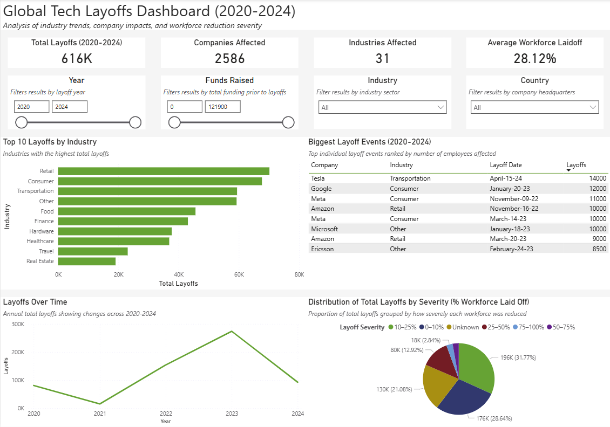

End-to-end data analytics project using SQL Server & Power BI

This project analyzes global tech layoffs between 2020–2024, using SQL for data cleaning and transformation and Power BI for interactive visualization.
The goal was to practice the full analytics pipeline: importing raw data, cleaning and modeling it, performing structured analysis, and building a clear dashboard that communicates key insights.

Dataset: Tech layoffs dataset from Kaggle (2020–2024)
Dataset URL: https://www.kaggle.com/datasets/theakhilb/layoffs-data-2022
Tools Used:
SQL Server Express — data cleaning, transformation, deduplication
Power BI — visual analysis, DAX, dashboard creation
DAX — calculated columns (e.g., severity categories based on % workforce laid off)

The project walks through:
Importing raw CSV data into SQL Server
Cleaning columns (TRIM, casting datatypes, fixing dates)
Handling nulls and removing duplicates
Creating a final layoffs_clean_deduped table for visualization
Performing KPI and trend analysis using SQL
Building a Power BI dashboard to communicate insights

Key Insights from the Dashboard
616K total layoffs across companies from 2020–2024
~2,586 companies reported layoffs
Retail, Consumer Tech, and Transportation were the hardest-hit industries
2023 saw the largest spike in layoffs
Most workforce reductions fell in the 10–25% severity band
The largest individual layoff events came from major tech companies like Tesla, Google, Meta, and Amazon

Key cleaning steps included:
Removing whitespace using TRIM()
Standardizing dates with CAST(date AS DATE)
Converting numeric fields (Laid_Off_Count, Percentage, Funds_Raised)
Removing duplicate entries with SELECT DISTINCT
Creating a final cleaned table: layoffs_clean_deduped
All SQL scripts used in this process are included (cleaning.sql, analysis.sql)

Power BI Dashboard Features
KPI cards (Total layoffs, companies affected, industries affected, average workforce laid off)
Year, industry, country, and funding slicers
Top 10 industries by total layoffs
Layoffs over time (2020–2024)
Biggest layoff events table
Workforce reduction severity pie chart using a DAX-calculated category column
The dashboard is exported as both .pbix and .pdf for easy viewing.

How to View This Project
Power BI Dashboard:
Open dashboard.pbix in Power BI Desktop
or
View the static dashboard via dashboard.pdf

SQL Scripts:
Review cleaning.sql and analysis.sql directly in this repo
Scripts run on SQL Server Express edition
